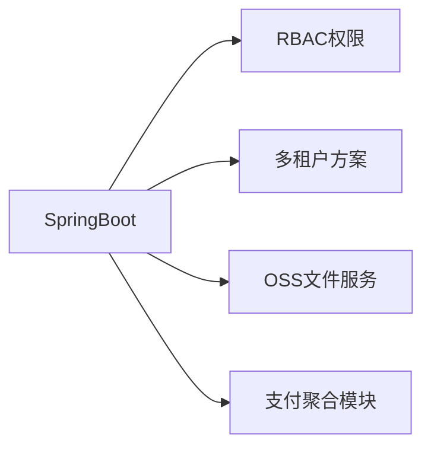

### 🛠 技术栈

### 🚀 专注领域
**中小企业数字化解决方案专家**  
为成长型企业提供：  
✅ 商城小程序，ERP系统定制开发  
✅ 进销存/CRM一体化方案  
✅ 业务中台快速搭建  
✅ 遗留系统现代化改造  
✅ 门店会员小程序

### 🌱 开源项目
#### [BizStarter](https://github.com/yourname/bizstarter) - 中小企业快速开发脚手架

### 📈 技术方案亮点
* **成本控制**：模块化架构降低60%二次开发成本

* **弹性扩展**：支持从单体到微服务的平滑演进

* **数据安全**：银行级加密方案保障企业核心资产

* **效率工具**：AI辅助生成标准业务模块代码

### 📝 技术博客精选
[中小企业如何选择技术架构](https://blog.soundjourney.top/article/details/104)

[SpringBoot多租户实践指南](https://blog.soundjourney.top/article/details/105)

[Vue3+Electron桌面应用开发](https://blog.soundjourney.top/article/details/106)

### 🤝 合作模式
* **标准化产品**：开箱即用的业务管理系统
* **定制开发**：基于实际业务流程深度适配
* **技术咨询**：现有系统问题诊断与优化

📫 找到我

     
     
    

